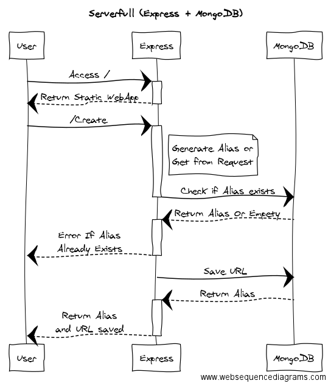

# jshort

Tiny NodeJS + MongoDB + Docker (+ serverless with AWS Lambda) URL shortener.

## Trying it out!

You can try the application on the link bellow:

[http://jshort.s3-website-us-east-1.amazonaws.com/](http://jshort.s3-website-us-east-1.amazonaws.com/)

I know, I know, this is not a short hostname, but it's serverless! This is waaaaay cooler (and cheaper).

BTW, the first call may be slow. To understand why check my [blog post](https://medium.com/@hollentor/melhores-pr%C3%A1ticas-serverless-com-lambda-e-api-gateway-8b1d62774e8d#.1649mjdve).

## Up and Running

This project runs on docker containers. To start the application run:

```
$ docker-compose up
```

The application will be available on `http://localhost:3000/`

## Testing

You can test the application accessing the app container (with `docker exec --it jshort sh`) and running:

```
$ npm test
```

If you want to test a remote service change the `APIHOSTNAME` to hostname where the API is located.

## Workflow

Bellow you can check a cool drawing describing the application flow on both Serverfull and Serverless versions.

They were made on this very neat website: [WebSequenceDiagram](https://www.websequencediagrams.com/)

### Serverfull



### Serverless

The serverless implementation is conceptually the same, but since ApiGateway substitutes Express and DynamoDB substitute Mongodb in a non-plugable way the code had to be re-written... ¯\\\_(ツ)\_/¯


# Deploy

You could deploy it with a docker on ElasticBeanStalk, or maybe create images for each service (mongod/jshort) and deploying on an EC2. But that you would end nonetheless with idle machines and also wory about creating an auto-scalling policy. That's just ugly.

# Reasons

Here is very quick list of reasons for each technology used.

### Docker?
Identical environment setup (prod/dev), easy to setup, replicable, beautiful.

### Express?
Light, fast, no-boilerplate

### MongoDB?
Fast, actually so fast you don't need for memcached tools. This project also doesn't needed a relational database.

### Serverless?
Serverless allow cheap (pay-per-request), on-demand, 'infinitly'-scalable applications.

It's so cheap that the first million requests or so every months are free because of AWS free-tier.

### jshort?

¯\\\_(ツ)\_/¯
